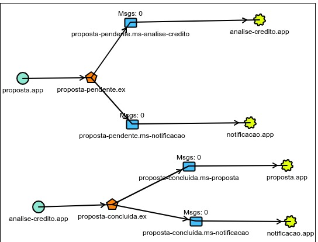

# Cadastro de Proposta de Credito

Este é um sistema para cadastro de Proposta de credito e seus usuarios desenvolvido utilizando Spring Boot, MapStruct e Maven.

## Funcionalidades Principais

- Cadastro de Usuarios.
- Cadastro de Proposta de Credito.

## Pré-requisitos

- JDK 17 ou superior
- Maven 3.x
- Banco de Dados (PostgreSQL, etc.)
- RabbitMQ
- Docker

## Instalação e Configuração

1. Clone este repositório: `git clone https://github.com/devlucasmart/proposta-api`
2. Navegue até o diretório do projeto: `cd proposta-api`
3. Configure as propriedades do banco de dados em `src/main/resources/application.yml`.
4. Execute o comando para levantar os containers do RabbitMQ e do PostgreSQL: `docker-compose up -d`.
5. Execute o comando para levantar o container do frontend: `docker run -d -p 80:80 --name front-microservices matheuspieropan/proposta-web`
5. Execute o projeto: `mvn spring-boot:run`.

## Documentação
- Link: http://localhost:8080/swagger-ui/index.html#/

## Microserviços
- notificacao: https://github.com/devlucasmart/notificacao-api  

## Estrutura das Filas e Exchanges Configuradas

